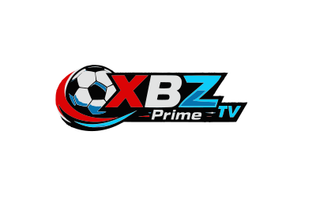

# ⚽ XBZ Prime TV

<div align="center">



**Premium Sports Live Streaming Platform**

[](https://naimxbzbd.github.io/XBZ-Prime-TV/)
[](https://github.com/naimxbzbd/XBZ-Prime-TV)
[](LICENSE)
[](#pwa-installation)
[](https://github.com/naimxbzbd)

</div>

---

## 📖 Table of Contents

- [Overview](#-overview)
- [Features](#-features)
- [Demo](#-demo)
- [Tech Stack](#-tech-stack)
- [Installation](#-installation)
- [PWA Installation](#-pwa-installation)
- [Project Structure](#-project-structure)
- [Configuration](#-configuration)
- [API Integration](#-api-integration)
- [Keyboard Shortcuts](#-keyboard-shortcuts)
- [Performance](#-performance)
- [Browser Support](#-browser-support)
- [Contributing](#-contributing)
- [Disclaimer](#-disclaimer)
- [Contact](#-contact)
- [License](#-license)

---

## 🌟 Overview

**XBZ Prime TV** is a production-ready Progressive Web Application for live sports streaming. Built with vanilla JavaScript using a modular component-based architecture, it delivers a premium streaming experience with support for HLS, MP4, DASH, and embedded streams.

The application automatically fetches and updates channel playlists from GitHub, displays live football scores via the Football Data API, and provides breaking news tickers — all within a stunning Neo-Brutalist + Glassmorphism UI.

---

## ✨ Features

### 🎬 Streaming Engine
- ✅ **Multi-Format Support** — HLS (m3u8), MP4, TS, MPD/DASH, HTML Embed, iFrame
- ✅ **Dual Playlist Sources** — Auto-fetch & merge from multiple GitHub raw URLs
- ✅ **Auto Update** — Playlist automatically refreshes every 30 minutes
- ✅ **Source Management** — Multiple sources per channel with failover
- ✅ **Retry Logic** — Automatic retry with 2s, 4s, 8s delays
- ✅ **Next Source** — Auto-switch to next available source on failure
- ✅ **Picture-in-Picture** — Pop-out video player
- ✅ **Fullscreen** — Immersive viewing experience
- ✅ **Watermark** — "XBZ Live TV" overlay

### 🏆 Live Football
- ✅ **Live Scores** — Real-time football scores via Football Data API
- ✅ **Match Cards** — Live, Upcoming & Finished tabs
- ✅ **Watch Button** — Auto-find matching sports channel for any match
- ✅ **Live Ticker** — Horizontal scrolling live score ticker
- ✅ **Auto Refresh** — Scores update every 10 seconds
- ✅ **League Emojis** — Visual league identification

### 📺 Channel Management
- ✅ **Auto Categories** — Categories generated dynamically from playlist
- ✅ **Search** — Real-time channel search with debounce
- ✅ **Category Filter** — Sidebar + dropdown filter
- ✅ **Quality Badges** — 4K, HD, SD detection
- ✅ **Live Status** — Online/offline indicator dots
- ✅ **Channel Count** — Dynamic total/filtered count

### 🎨 UI/UX
- ✅ **Neo-Brutalism Design** — Bold borders, solid shadows, 16px rounded
- ✅ **Glassmorphism** — Frosted glass effects
- ✅ **Dark/Light Mode** — Toggle with system preference detection
- ✅ **Responsive** — Mobile, Tablet, Desktop optimized
- ✅ **Android App Style** — Bottom navigation on mobile
- ✅ **Smooth Animations** — Entrance animations, hover effects, transitions
- ✅ **Toast Notifications** — Success, Error, Info, Warning toasts
- ✅ **Skeleton Loading** — Content placeholders during loading

### 📱 PWA
- ✅ **Installable** — Add to Home Screen
- ✅ **Offline Support** — Service Worker with caching strategies
- ✅ **Manifest** — Full web app manifest
- ✅ **Background Sync** — Content refresh in background
- ✅ **Push Notifications** — Ready for push alerts

### 🔧 Technical
- ✅ **Zero Dependencies** — No React, Vue, Angular, Bootstrap, jQuery, Tailwind
- ✅ **Modular Architecture** — Component-based vanilla JS
- ✅ **Centralized State** — Single state management
- ✅ **Performance Optimized** — Debounce, throttle, lazy loading
- ✅ **Accessible** — ARIA labels, keyboard navigation, focus management
- ✅ **SEO Ready** — Meta tags, OG tags, structured data, sitemap

---

## 🎮 Demo

**Live Demo:** [https://naimxbzbd.github.io/XBZ-Prime-TV/](https://naimxbzbd.github.io/XBZ-Prime-TV/)

---

## 🛠 Tech Stack

| Category | Technology |
|----------|------------|
| **Frontend** | HTML5, CSS3, Vanilla JavaScript (ES2023) |
| **Video Player** | Video.js 8.10, HLS.js 1.5.8 |
| **Icons** | Font Awesome 6.5 |
| **Fonts** | Space Grotesk, Inter (Google Fonts) |
| **API** | Football Data API v4 |
| **Data** | GitHub Raw (M3U Playlists, JSON) |
| **PWA** | Service Worker, Web App Manifest |
| **Hosting** | GitHub Pages |

---

## 📦 Installation

### Local Development

1. **Clone the repository:**

```bash
git clone https://github.com/naimxbzbd/XBZ-Prime-TV.git
cd XBZ-Prime-TV

 
